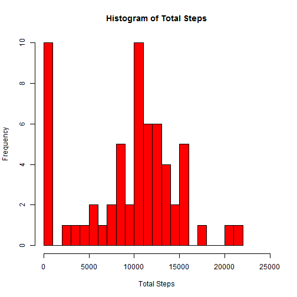
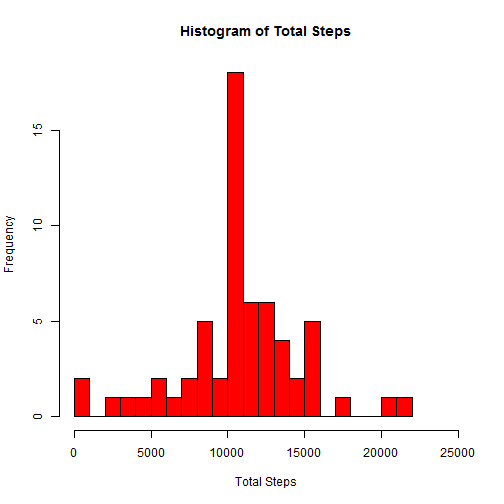
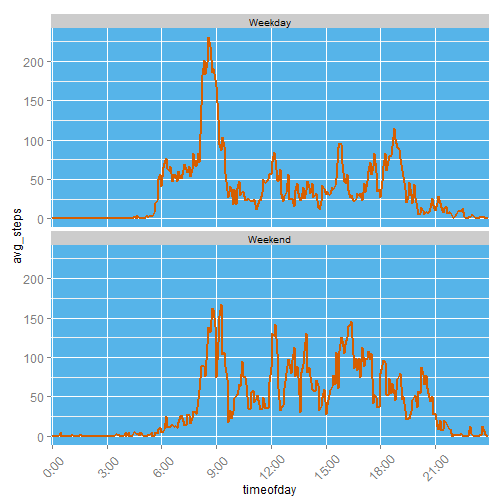

We will be using the dplyr package to manipulate the data and ggplot2 package to 
create the graphs. We need the following libraries


```r
library(dplyr)
library(ggplot2)
library(lubridate)
```
The activity dataset that we are using in this example can be downloaded from 
<a href="https://d396qusza40orc.cloudfront.net/repdata%2Fdata%2Factivity.zip">Activity Monitoring data</a>
We will read the data into a data frame. The tbl_df function of dplyr package makes the data frame 
easy to print. Also the date column is set to the date format. We also added 2 columns to the dataset as follows <br/>
wday - to identify week day <br/>
day - to identify whether it's a weekday or weekend. 


```r
activity <- read.csv("activity/activity.csv", header=T, sep=",")
activity <- tbl_df(activity)
activity$date <- as.Date(activity$date, '%Y-%m-%d')
activity <- activity %>% 
        mutate(wday = wday(date, label=T), 
               day = ifelse((wday=="Sat" | wday == "Sun"), "Weekend", "Weekday"))
```

Let's take a look at the activity dataset.

```
## Source: local data frame [17,568 x 5]
## 
##    steps       date interval wday     day
## 1     NA 2012-10-01        0  Mon Weekday
## 2     NA 2012-10-01        5  Mon Weekday
## 3     NA 2012-10-01       10  Mon Weekday
## 4     NA 2012-10-01       15  Mon Weekday
## 5     NA 2012-10-01       20  Mon Weekday
## 6     NA 2012-10-01       25  Mon Weekday
## 7     NA 2012-10-01       30  Mon Weekday
## 8     NA 2012-10-01       35  Mon Weekday
## 9     NA 2012-10-01       40  Mon Weekday
## 10    NA 2012-10-01       45  Mon Weekday
## ..   ...        ...      ...  ...     ...
```
As you can see there are a lot of NAs for steps in the dataset. We'll have remove them whenever we
we do an aggregation on the data. Later, we'll fill the unkonwns with values to make the data set cleaner
First we'll group the dataset by date and calculate the total number of steps taken per day.


```r
by_date <- activity %>% group_by(date)
steps <- summarise(by_date, tot_steps = sum(steps, na.rm=TRUE))
```

Below is the histogram of the total number of steps 


```r
hist(steps$tot_steps, breaks=20,  col="red", 
                main="Histogram of Total Steps", 
                xlab="Total Steps", xlim = c(0,25000))
```

 

Let's now find the Mean and median number of steps per day


```r
steps_summary <- summarise(steps, avg_steps = mean(tot_steps, na.rm=TRUE), 
                           median_steps = median(tot_steps, na.rm=TRUE))
```

And below is the mean and median steps per day

```
## Source: local data frame [1 x 2]
## 
##   avg_steps median_steps
## 1   9354.23        10395
```

We'll first change the format of the interval column to make it more readable since it's actually the time of the day. We'll then make it a factor variable and also add create a theme for the graph which can be reused.


```r
by_interval <- activity %>% group_by(interval)
interval_steps <- summarise(by_interval, avg_steps = round(mean(steps, na.rm=TRUE)))
interval_steps <- interval_steps %>% 
                        mutate (intervalnum = seq_along(interval) - 1,
                        mins = intervalnum * 5,
                        timeofday = paste(floor(mins/60),":",ifelse(nchar(mins%%60)==1,paste("0",mins%%60,sep=""),mins%%60), sep="")) 
        

interval_steps <- transform(interval_steps, intervalnum = factor(intervalnum, labels = timeofday))

theme <- theme(
                axis.text = element_text(size=12),
                axis.text.x  = element_text(angle=45, vjust=0.5),
                panel.background = element_rect(fill = "#56B4E9")
        )
```
Let's plot the graph below to see the steps taken by the time of the day..


```r
p <- ggplot(interval_steps, aes(x = intervalnum, y = avg_steps), group = 1)
p <- p + geom_line(aes(group=1)) + 
        xlab("Time of Day") + 
        scale_x_discrete(breaks=c("0:00", "3:00", "6:00", "9:00", "12:00","15:00","18:00","21:00","24:00")) +
        theme
```

 

As you can see the average # of steps taken peaks somewhere close to 9 AM. Let's see which interval
recorded the Maximum average # of steps 


```r
max_interval <- filter(interval_steps, avg_steps == max(avg_steps))
```

The average # of steps peaked at 206 around 8:35 AM as shown below


```
##   interval avg_steps intervalnum mins timeofday
## 1      835       206        8:35  515      8:35
```

Now let's see how many rows are there with NAs for the steps column. 


```r
narows <- activity %>% filter(is.na(steps)) %>% summarise(count=n())
```
There are 2304 rows that have NAs for # of steps.

```
## Source: local data frame [1 x 1]
## 
##   count
## 1  2304
```


let's now merge the activity dataset with the dataset that has the average steps for each interval


```r
activity_new <- inner_join(activity, interval_steps, c("interval"))
```

Wherever the steps are not known, we'll use the average steps for that interval


```r
activity_new <- mutate(activity_new, steps_new = ifelse(is.na(steps), avg_steps, steps))
```

we'll keep only the columns that we need and get a clean data frame


```r
activity_new <- select(activity_new, interval, timeofday=intervalnum, steps = steps_new, date, wday, day)
```
Let's see what our new activity dataset looks like..


```
## Source: local data frame [17,568 x 6]
## 
##    interval timeofday steps       date wday     day
## 1         0      0:00     2 2012-10-01  Mon Weekday
## 2         5      0:05     0 2012-10-01  Mon Weekday
## 3        10      0:10     0 2012-10-01  Mon Weekday
## 4        15      0:15     0 2012-10-01  Mon Weekday
## 5        20      0:20     0 2012-10-01  Mon Weekday
## 6        25      0:25     2 2012-10-01  Mon Weekday
## 7        30      0:30     1 2012-10-01  Mon Weekday
## 8        35      0:35     1 2012-10-01  Mon Weekday
## 9        40      0:40     0 2012-10-01  Mon Weekday
## 10       45      0:45     1 2012-10-01  Mon Weekday
## ..      ...       ...   ...        ...  ...     ...
```
Below we will create a the same histogram of # of steps with the new activity dataset. Since we removed the NAs and used the average steps for the time as proxy, the average steps went up from previous analysis.

```r
by_date <- group_by(activity_new, date)
steps <- summarise(by_date, tot_steps = sum(steps, na.rm=TRUE))
hist(steps$tot_steps, breaks=20,  col="red", main="Histogram of Total Steps", 
                xlab="Total Steps", xlim = c(0,25000))
```

 

```r
steps_summary <- summarise(steps, avg_steps=mean(tot_steps, na.rm=TRUE), 
                           median_steps = median(tot_steps, na.rm=TRUE))
```


```
## Source: local data frame [1 x 2]
## 
##   avg_steps median_steps
## 1  10765.64        10762
```

Finally we'll see whether there's a differenece in pattern for the # of steps between weekdays and weekends. We'll use the variables that we created initially and plot the graph as below. Weekends show slightly more steps during the afternoon than in the mornings.


```r
activity_new <- transform(activity_new, day = factor(day))

by_day_interval <- group_by(activity_new, day, timeofday)

wday_steps <- summarise(by_day_interval, avg_steps = round(mean(steps)))
p <- ggplot(wday_steps, aes(x=timeofday, y=avg_steps, group=day)) + facet_wrap(~day, nrow=2) + 
        geom_line(size = 1, color="#D55E00") +
        scale_x_discrete(breaks=c("0:00", "3:00", "6:00", "9:00", "12:00","15:00","18:00","21:00","24:00")) +
        theme
```
 

